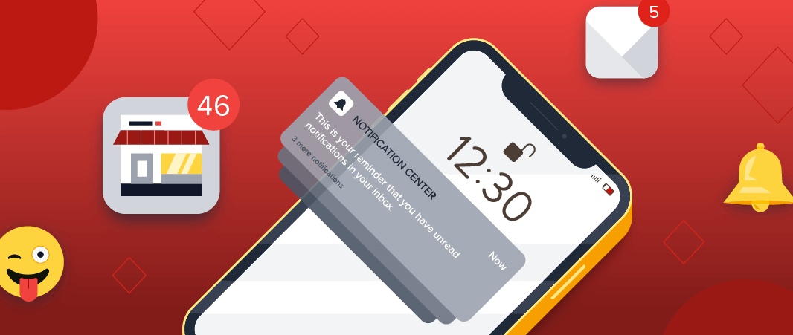
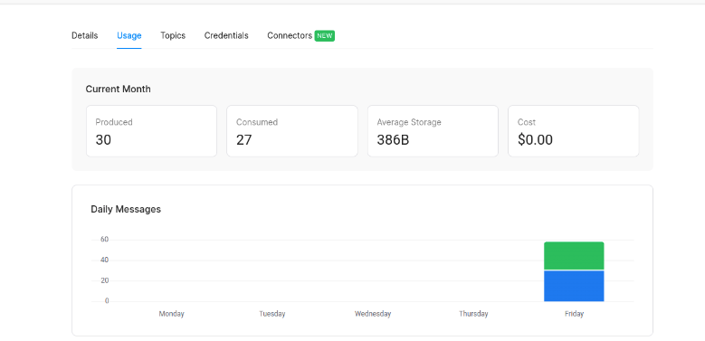
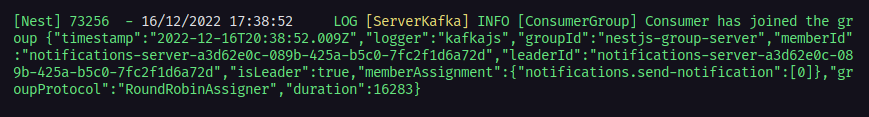
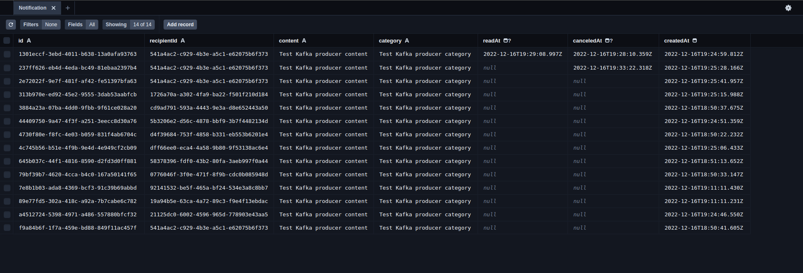

# Notifications Service - NestJS - Clean Architecture

<p align="center">
  
  
  
</p>
<br>

<p align="center">
  <a href="#sobre">Sobre</a> •
  <a href="#notifications-service">Notifications Service</a> •
  <a href="#instalação">Instalação</a> •
  <a href="#tecnologias">Tecnologias</a> •
  <a href="#autor">Autor</a>
</p>

<br>

## Sobre

Projeto desenvolvido os conceitos de Clean Arch, DDD, SOLID, Decorator, Adapters, Repositories, InMemoryDatabase, Mappers, ViewModels, DI (Depedency Injection), Use-cases pattern e Jest.

Prisma como ORM (Object Relational Mapper)
Typescript (superset do Javascript com tipagem estática)
Apache Kafka (mensageria)



## Notifications Service

O Notifications Service é um microsserviço responsável por lidar com notificações de diversas fontes. A ideia do projeto é entender como arquitetar um microsserviço de melhor maneira afim de tê-lo desacoplado de qualquer tecnologia do meio externo e que seja altamente escalável, seguindo as melhores praticas de programação com esse tipo de arquitetura e as tecnologias mais modernas do momento no mundo do NodeJS.

Esse projeto é um consumer do Kafka que irá consumir mensagens de um tópico chamado `notifications.send-notification` e irá realizar registros das notificações em uma tabela no banco de dados.

O cluster Kafka pode ser criado de diversas formas e integrado ao projeto, a maneira realizada aqui foi utilizando o serviço [Upstash](https://console.upstash.com/kafka). Ao acessa-lo, basta criar uma conta, criar o cluster e tópico e conectar a aplicação a ele. Deixo abaixo um exemplo do dashboard de uso do serviço aonde realizei os testes da aplicação:



Como podemos ver acima, no momento do print-screen, havia produzido 30 mensagens, das quais 27 foram consumidas por esse microsserviço e registradas em nosso banco de dados.

Ao executar a aplicação, ela se conecta ao nosso cluster e consome as mensagens que estão no tópico:



Caso existam mensagens a serem consumidas, a aplicação as consome e gera os registros em nosso BD, nesse caso, um banco SQLite. Vamos ver os registros no exemplo abaixo:



A aplicação utiliza o Prisma e executando o comando `prisma studio` conseguimos subir uma interface web para visualizar nosso banco de dados, aonde podemos ver as notificações sendo registradas.

Para manipular nossos registros a aplicação conta com uma API REST contendo endpoints para criar e cancelar notificações, marca-las como lidas e não lidas, além de rotas para obter o total de notificações ou as próprias notificações de um usuário.

Deixarei abaixo a coleção das requisições para serem importadas no Insomnia:

[](./readme/endpoints.json)

Como esse microsserviço é apenas um consumer, deixarei nesse repositório a pasta `notifications-kafka-producer`, a qual contem o código de um simples producer kafka para gerar as mensagens a serem consumidas pelo notifications-service.

## Instalação

Antes de começar, você vai precisar ter instalado em sua máquina as seguintes ferramentas:
[Git](https://git-scm.com), [Node.js](https://nodejs.org/en/).
Além disso é bom ter um editor para trabalhar com o código como [VSCode](https://code.visualstudio.com/).

### 🎲 Rodando o Back End (servidor)

```bash
# Clone este repositório
$ git clone https://github.com/ocoiel/notification-service.git

# Acesse a pasta do projeto no terminal/cmd
$ cd notification-service

# Instale as dependências
$ npm install
# Caso prefira usar o Yarn execute o comando abaixo
$ yarn
# Caso prefira usar o pnpm execute o comando abaixo
$ pnpm i

# Execute a aplicação em modo de desenvolvimento
$ npm run start:dev
# Caso prefira usar o Yarn execute o comando abaixo
$ yarn start:dev
# Caso prefira usar o pnpm execute o comando abaixo
$ pnpm run start:dev

# Execute os testes da aplicação
$ npm run start:test
# Caso prefira usar o Yarn execute o comando abaixo
$ yarn start:test
# Execute os testes da aplicação
$ pnpm run start:test

# O servidor inciará na porta 3333 - acesse <http://localhost:3333>
```

## Tecnologias


<br><br><br>

## Autor

<div align="center">

<h1>Gabriel Albuquerque</h1>
<strong>Software Developer</strong>
<br/>
<br/>

<a href="https://linkedin.com/in/albuquerque-gabrielc" target="_blank">

</a>

<a href="https://github.com/ocoiel" target="_blank">

</a>

<a href="mailto:albuquerque.gabrielc@gmail.com?subject=Fala%20Dev" target="_blank">

</a>

<a href="https://api.whatsapp.com/send?phone=5521990363677" target="_blank">

</a>

<br/>
<br/>
</div>
